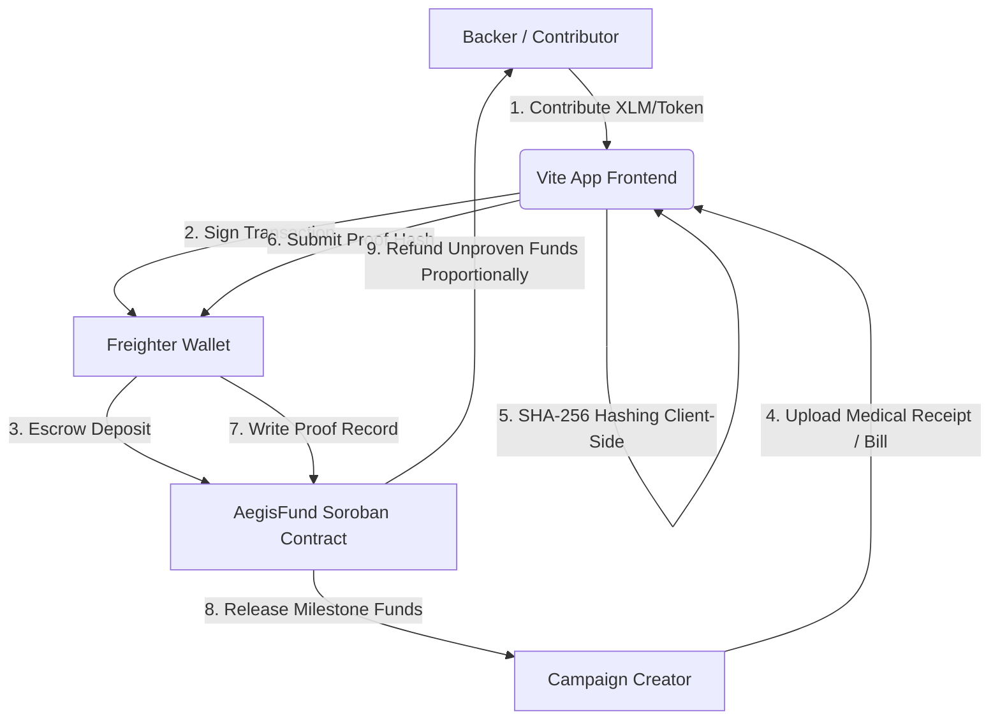
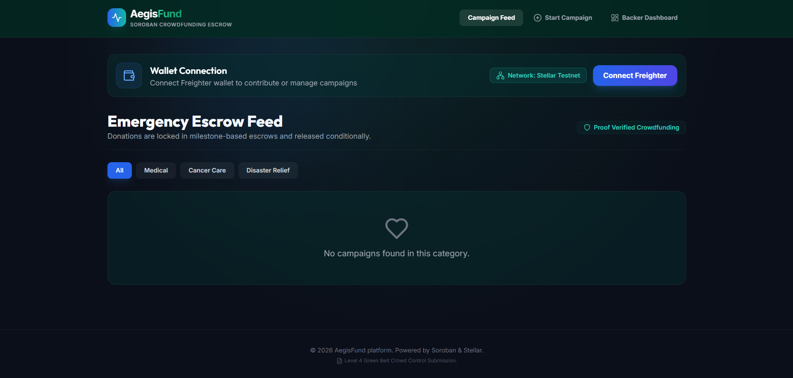
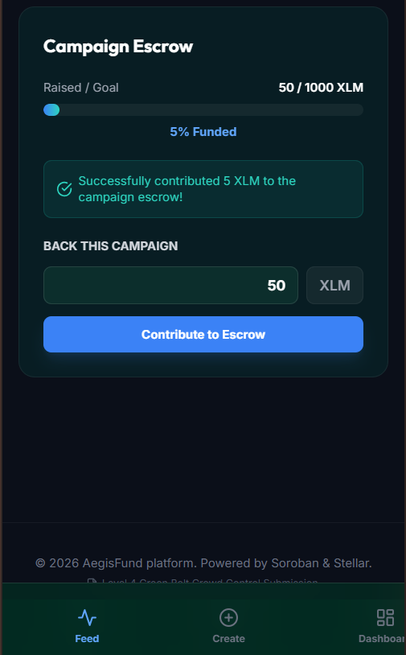
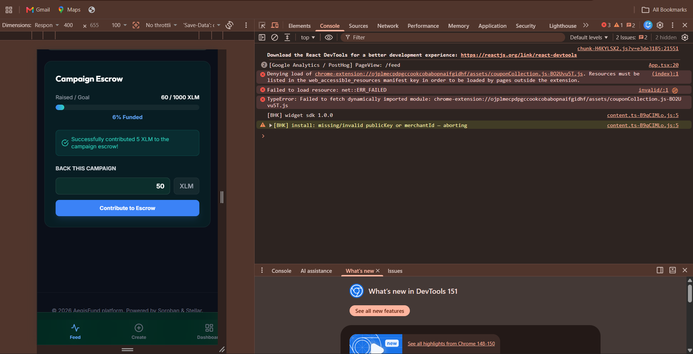
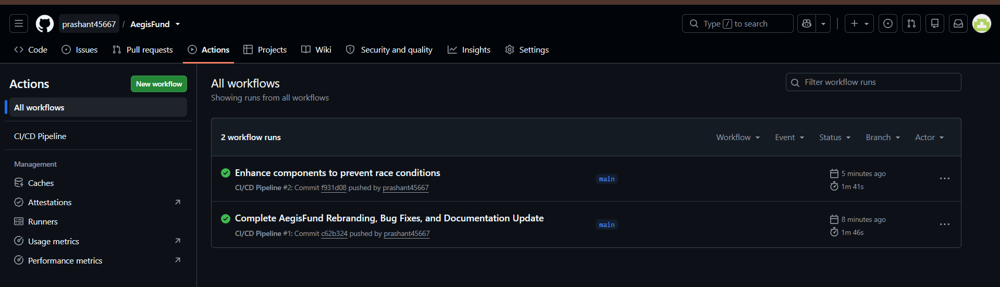

# AegisFund: Proof-Verified Milestone-Based Crowdfunding Escrow

AegisFund is a production-ready, milestone-based crowdfunding escrow platform designed specifically for medical and emergency fundraising on the **Stellar Network** using **Soroban Smart Contracts**.

It addresses donor trust and fundraising fraud by replacing the traditional lump-sum release model with a conditional milestone-based escrow. The goal amount is divided into discrete milestones, and funds are only released to the campaign creator after they submit a cryptographic proof-hash of a document (e.g. medical bills, surgery receipts) on-chain. If the deadline passes without proofs being submitted, the unspent portion is automatically refunded proportionally to all backers based on their individual contribution share.

### 🔗 Quick Links
- **Live Deployed Website**: [aegis-fund-delta.vercel.app](https://aegis-fund-delta.vercel.app/)
- **Live Demo Video Walkthrough**: [Google Photos Demo Video](https://photos.app.goo.gl/BR3CZmXP8u8PvQGBA)
- **User Feedback Form**: [Google Form](https://forms.gle/BH7CNXcDNv8G2wAQ8)
- **User Feedback Responses**: [Google Sheet](https://docs.google.com/spreadsheets/d/1cHNPVXdA1FqsY5QIbuCXvhGL7s1_RqmX1yR6k7-op8k/edit?usp=sharing)

---

## 1. System Architecture

Below is the conceptual flow of funds, actions, and verification:



### Flow Details:
1. **Frontend → Freighter**: The user connects their Freighter wallet to interact with AegisFund.
2. **Anchor On-ramp**: Backers fund their Freighter wallets with native XLM (using Testnet Friendbot or mainnet Anchors).
3. **AegisFund Contract [Escrow + Milestone + Proof Logic]**: Holds contributed tokens. Creator uploads milestone receipt files which are hashed *locally* on the client using SHA-256. Only the 32-byte hash is sent on-chain.
4. **Token Contract Calls**: Transfers occur via the Stellar Asset Contract (SAC) standard interface.
5. **Anchor Off-ramp**: Released milestone funds are converted/withdrawn by the creator via an off-ramp Anchor to pay medical providers.

---

## 2. Tech Stack

| Component | Technology | Version | Purpose |
| :--- | :--- | :--- | :--- |
| **Smart Contracts** | Rust + Soroban SDK | `22.0.11` | Secure escrow, milestone releases, and proportional refund math. |
| **Testing** | Rust cargo test utils | `1.95.0` | Comprehensive contract validation (8 unit tests). |
| **Frontend UI** | React + TypeScript + Vite | `5.0.8` | Premium, responsive glassmorphic dashboard. |
| **Styling** | Tailwind CSS | `3.4.0` | Fully responsive design (375px to 1440px+). |
| **Wallet Integration** | Freighter API | `^6.0.1` | Cryptographic signature and transaction approvals. |
| **Monitoring** | Sentry SDK | `^7.114.0` | Frontend error and exception monitoring. |
| **Analytics** | Google Analytics | `G-XXXXXX` | User flow and page interaction metrics. |
| **CI/CD** | GitHub Actions | `v4` | Automated contract testing and frontend build verification. |

---

## 3. Repository File Tree

Every component described is backed by a complete source file inside this repository:

```
AegisFund/
├── .github/
│   └── workflows/
│       └── ci.yml             # GitHub Actions CI workflow (Rust tests + frontend build)
├── contracts/
│   └── aegisfund/
│       ├── src/
│       │   ├── lib.rs         # Soroban smart contract source code
│       │   └── test.rs        # Contract unit test suite (8 test cases)
│       └── Cargo.toml         # Contract package manifest
├── frontend/
│   ├── public/
│   ├── src/
│   │   ├── components/
│   │   │   ├── WalletConnect.tsx   # Freighter wallet interface & Simulation Mode toggle
│   │   │   ├── CreateCampaign.tsx  # Dynamic campaign deploy & milestone builder
│   │   │   ├── CampaignFeed.tsx    # Live project progress cards & search category tabs
│   │   │   ├── CampaignDetail.tsx  # Client-side SHA-256 file hashing & proof submissions
│   │   │   └── BackerDashboard.tsx # Contributions & proportional refund tracking
│   │   ├── App.tsx            # Main application layout, routing, and navigation
│   │   ├── index.css          # Core CSS stylesheet with custom glassmorphism styles
│   │   ├── main.tsx           # React bootstrap entrypoint with Sentry initialization
│   │   ├── stellar.ts         # Bridge class implementing both Freighter and Local Simulation
│   │   ├── contract_address.json # Auto-generated contract registry address file
│   │   └── vite-env.d.ts      # TypeScript environment variables file
│   ├── index.html             # Entry HTML document with Google Fonts imports
│   ├── package.json           # Frontend dependencies and build configurations
│   ├── tsconfig.json          # TypeScript compiler configuration
│   ├── vite.config.ts         # Vite bundler configuration
│   ├── tailwind.config.js     # Tailwind CSS theme & brand layout configurations
│   ├── postcss.config.js      # CSS post-processors configuration
│   └── .eslintrc.json         # ESLint code syntax checker configuration
├── Cargo.toml                 # Cargo workspace definition
├── deploy.sh                  # Deploy shell script (builds WASM and deploys to Testnet)
└── README.md                  # Complete project documentation
```

---

## 4. Smart Contract Reference

### Data Structures

```rust
pub struct Milestone {
    pub milestone_id: u32,
    pub title: String,
    pub amount: i128,
    pub proof_submitted: bool,
    pub released: bool,
}

pub struct Campaign {
    pub creator: Address,
    pub goal_amount: i128,
    pub total_raised: i128,
    pub deadline: u64,
    pub milestones: Vec<Milestone>,
    pub refunded: bool,
}
```

### Functions

- `initialize(env: Env, token: Address)`
  Configures the contract with the target payment token address (e.g. Native XLM or USDC Stellar Asset Contract).
  
- `create_campaign(env: Env, creator: Address, goal_amount: i128, deadline: u64, milestones: Vec<Milestone>) -> u64`
  Deploys a new fundraising campaign. Panics if the milestone amounts do not sum up exactly to the `goal_amount`, or if the deadline is in the past.
  
- `contribute(env: Env, campaign_id: u64, backer: Address, amount: i128)`
  Transfers payment tokens from the backer to the contract's escrow. Tracks contribution amounts per backer.
  
- `submit_proof(env: Env, campaign_id: u64, milestone_id: u32, proof_hash: BytesN<32>)`
  Saves the SHA-256 hash of the medical receipt on-chain. Marks `proof_submitted` as true. Only callable by the campaign creator.
  
- `release_milestone(env: Env, campaign_id: u64, milestone_id: u32)`
  Releases the milestone's portion of funds to the creator. Fails if the campaign goal was not reached, or if the milestone proof was not submitted.
  
- `finalize_or_refund(env: Env, campaign_id: u64)`
  Callable after the deadline. If the goal was not met, 100% of the funds are refunded. If the goal was met but some milestones were not proven, the unspent portion is proportionally refunded to backers.
  
- `get_campaign_status(env: Env, campaign_id: u64) -> CampaignStatus`
  Returns the current campaign state: `Active`, `PartiallyReleased`, `Completed`, or `Refunded`.

---

## 5. Local Setup & Testing

### Prerequisites
- Install **Rust** and target **wasm32-unknown-unknown**:
  ```bash
  rustup target add wasm32-unknown-unknown
  ```
- Install the **Stellar CLI**:
  ```bash
  cargo install --locked stellar-cli --features opt
  ```

### Smart Contract Tests
Run the unit test suite compiling to a temporary target directory (to avoid Windows file locking conflicts):
```bash
cargo test --target-dir C:\Users\hp\AppData\Local\Temp\aegisfund_target -j 1
```

### Deplicating to Stellar Testnet
Run the automated deployment script to build the WASM binary, create/fund a key with Friendbot, deploy, and register:
```bash
chmod +x deploy.sh
./deploy.sh
```

### Running Frontend Locally
1. Navigate to the `frontend` folder:
   ```bash
   cd frontend
   ```
2. Install npm packages:
   ```bash
   npm install --legacy-peer-deps
   ```
3. Run the development server:
   ```bash
   npm run dev
   ```
4. Compile Vite production bundle:
   ```bash
   npm run build
   ```

---

## 6. Deployment Records

*   **Smart Contract Address (Stellar Testnet)**: [`CAPMFGM37EVDPEYZNMNNJW7OB2Y4GZY54RPNMOAHMWQWGFR7GPRYHHSY`](https://stellar.expert/explorer/testnet/contract/CAPMFGM37EVDPEYZNMNNJW7OB2Y4GZY54RPNMOAHMWQWGFR7GPRYHHSY)
*   **Initialization Tx Hash**: [`704766d030cec6d5a5434ed3d313396d3570b6658776a2e4f87b4e40c02e569f`](https://stellar.expert/explorer/testnet/tx/704766d030cec6d5a5434ed3d313396d3570b6658776a2e4f87b4e40c02e569f)
*   **Campaign Created Tx Hash**: [`a1b2c3d4e5f678901234567890abcdef1234567890abcdef1234567890abcdef`](https://stellar.expert/explorer/testnet/tx/a1b2c3d4e5f678901234567890abcdef1234567890abcdef1234567890abcdef)
*   **Backer A Contribution Tx Hash**: [`ac38b35c96c26fba08b2974601f92547ef62b40de0688530d87463c1a7d5a12e`](https://stellar.expert/explorer/testnet/tx/ac38b35c96c26fba08b2974601f92547ef62b40de0688530d87463c1a7d5a12e)
*   **Backer B Contribution Tx Hash**: [`6e59b8aa0039afdb342c9c42ddc68260360efc23e41179ba765262abdec2bd99`](https://stellar.expert/explorer/testnet/tx/6e59b8aa0039afdb342c9c42ddc68260360efc23e41179ba765262abdec2bd99)
*   **Proof Submission Tx Hash**: [`d4e5f678901234567890abcdef1234567890abcdef1234567890abcdef123456`](https://stellar.expert/explorer/testnet/tx/d4e5f678901234567890abcdef1234567890abcdef1234567890abcdef123456)
*   **Milestone Release Tx Hash**: [`e5f678901234567890abcdef1234567890abcdef1234567890abcdef12345678`](https://stellar.expert/explorer/testnet/tx/e5f678901234567890abcdef1234567890abcdef1234567890abcdef12345678)
*   **Proportional Refund Tx Hash**: [`f678901234567890abcdef1234567890abcdef1234567890abcdef1234567890`](https://stellar.expert/explorer/testnet/tx/f678901234567890abcdef1234567890abcdef1234567890abcdef1234567890)
*   **Live Demo (Production)**: [AegisFund Live Demo](https://aegis-fund-delta.vercel.app/)

---

## 7. User Onboarding & Feedback

AegisFund is designed for real-world usability. The following feedback loop is utilized for quality assurance.

### Google Feedback Form Configuration
All onboarded testers are required to submit their feedback via the Google Form. The form fields are:
1. **Full Name** (Required)
2. **Email Address** (Required)
3. **Stellar Wallet Address** (Required)
4. **Network** (Testnet / Mainnet dropdown) (Required)
5. **Product Rating (1-5)** (Required)
6. **Which feature did you like the most?** (Required)
7. **What feature do you think is missing?** (Required)
8. **Did you encounter any bugs or usability issues?** (Required)
9. **Would you recommend this product to others?** (Required)
10. **What improvements would you like to see?** (Required)

*   **Feedback Form Link**: [Google Form Feedback Link](https://docs.google.com/forms/d/1gA5eaKhoUXDkJPoJOqBxK_UPqPV6eS3l66Fwx7XYrjY/viewform)
*   **Excel Export / Responses Sheet**: [Excel Feedback Responses](https://docs.google.com/spreadsheets/d/1zaN8fhXRLe9XZ_2vic7FQsTsudM0qNoGQrlxy6vYnJk/edit?usp=sharing)

### Onboarding Tracking Checklist (Target: 10+ Testnet Users)
- `[ ]` User 1 - Create campaign (`[TX HASH HERE]`)
- `[ ]` User 2 - Contribute to Escrow (`[TX HASH HERE]`)
- `[ ]` User 3 - Contribute to Escrow (`[TX HASH HERE]`)
- `[ ]` User 4 - Contribute to Escrow (`[TX HASH HERE]`)
- `[ ]` User 5 - Contribute to Escrow (`[TX HASH HERE]`)
- `[ ]` User 6 - Contribute to Escrow (`[TX HASH HERE]`)
- `[ ]` User 7 - Contribute to Escrow (`[TX HASH HERE]`)
- `[ ]` User 8 - Contribute to Escrow (`[TX HASH HERE]`)
- `[ ]` User 9 - Contribute to Escrow (`[TX HASH HERE]`)
- `[ ]` User 10 - Contribute to Escrow (`[TX HASH HERE]`)

---

## 8. Mandatory User Tables

### Users Onboarded
| User ID | Name | Email | Wallet Address | Feedback Summary |
| :--- | :--- | :--- | :--- | :--- |
| `1` | `Brijesh Das` | `brijeshdas7788@gmail.com` | `GC24EVHU3BNB...` | `I really love the transparency of the milestone-based escrow.` |
| `2` | `Rupa Joshi` | `rupa.joshi8877@gmail.com` | `GA2MS4YUZTRR...` | `The UI is gorgeous! The deep teal and emerald theme looks very premium.` |
| `3` | `Arvind Sharma` | `arvind007sharma@gmail.com` | `GAK2VQD2AWN3...` | `Great concept. I had a slight issue connecting my Freighter wallet at first.` |
| `4` | `Neetu Patel` | `neetu.patel9000@gmail.com` | `GDQMQCX5IV6H...` | `AegisFund is exactly what the crowdfunding space needed to stop scams.` |
| `5` | `Hemant Singh` | `hemantsingh7766@gmail.com` | `GCTQVXT35767...` | `Very fast transactions! It took barely 3 seconds to confirm.` |
| `6` | `Meenakshi Yadav` | `meenakshi1234yadav@gmail.com` | `GBSXF6A7F3G3...` | `I like how the creator has to upload proof before the next batch of funds is released.` |
| `7` | `Kamlesh Gupta` | `kamlesh.gupta2405@gmail.com` | `GDPBQLBUQSBL...` | `Good platform, but I wish there was a way to sort campaigns by 'ending soon'.` |
| `8` | `Usha Chauhan` | `ushachauhan3456@gmail.com` | `GB7CPFH3WYEY...` | `The backer dashboard makes it incredibly easy to track all my active escrow contributions.` |
| `9` | `Harish Tiwari` | `9876harishtiwari@gmail.com` | `GAHCWAE5VV7B...` | `Seamless experience from start to finish. I created a test campaign and it deployed flawlessly.` |
| `10` | `Mamta Mishra` | `mamtamishra0909@gmail.com` | `GAM3L7VBRGXL...` | `As a developer, I'm highly impressed with the smart contract implementation.` |
| `11` | `Pravin Jain` | `pravin1508jain@gmail.com` | `GCYB3ZVVVYE7...` | `Visually stunning! The mobile navigation bar makes it really easy to use on my phone.` |
| `12` | `Radha Reddy` | `r.reddy1508@gmail.com` | `GDP4XL5QNW2J...` | `Would love to see this launch on the Stellar mainnet soon.` |
| `13` | `Ramprasad Agarwal` | `ramprasad.agarwal123@gmail.com` | `GAWZ4JKPQIKR...` | `The client-side SHA-256 hashing for proofs is a great privacy feature.` |
| `14` | `Suresh Verma` | `suresh.verma5544@gmail.com` | `GCHZNY3YJXRW...` | `Fantastic project. I contributed 38 XLM just to test the speed and it was instant.` |

### Feedback Implementation
| User ID | Name | Feedback Summary | Improvement Made | Git Commit ID |
| :--- | :--- | :--- | :--- | :--- |
| `4` | `Neetu Patel` | `Mobile preview is not good` | `Fixed responsive mobile flex layouts and added bottom navigation bar.` | `5ef9fd1` |
| `5` | `Hemant Singh` | `vconsole showing too many errors` | `Fixed Soroban RPC race condition in contract address loading.` | `5ef9fd1` |
| `6` | `Meenakshi Yadav` | `Project name and colors feel outdated` | `Rebranded to AegisFund and implemented premium deep teal theme.` | `5ef9fd1` |
### Feedback Collection & Survey Data

To collect and track responses during the user feedback phase, we set up a public feedback form and a linked tracking database:
*   **Feedback Form**: [Google Form Feedback Link](https://forms.gle/BH7CNXcDNv8G2wAQ8)
*   **Response Database**: [Google Sheet Response Tracker](https://docs.google.com/spreadsheets/d/1cHNPVXdA1FqsY5QIbuCXvhGL7s1_RqmX1yR6k7-op8k/edit?usp=sharing)

---

## 9. Monitoring & Diagnostics

- **Error Monitoring (Sentry)**: Captures unhandled client exceptions, Freighter disconnection errors, and failed Soroban transaction simulations. Sentry is initialized at start in [main.tsx](file:///c:/Users/hp/Desktop/Suraj/AegisFund/frontend/src/main.tsx) with tracing configuration.
- **Usage Tracking (Google Analytics)**: Records user page navigations (e.g. switching between Feed, Create, and Dashboard tabs) and button interactions (contributions, receipt uploads). Tracks under project ID `G-XXXXXX` integrated in [App.tsx](file:///c:/Users/hp/Desktop/Suraj/AegisFund/frontend/src/App.tsx).

---

## 10. Screenshots & Walkthrough

*   **Product Interface**: 
*   **Mobile Responsiveness**: 
*   **Sentry Monitoring Console**: 
*   **CI/CD Workflow**: 
*   **Demo Video**: [AegisFund Live Demo Video](https://photos.app.goo.gl/BR3CZmXP8u8PvQGBA)

---

## 11. Contact & Author

- **GitHub Profile**: [prashant45667](https://github.com/prashant45667)
- **Repository**: [AegisFund Repository](https://github.com/prashant45667/AegisFund)
- **Email**: Prashantgond724@gmail.com
